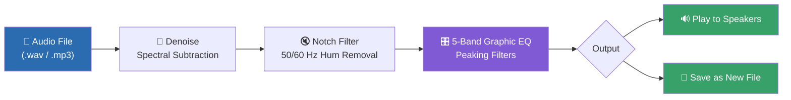
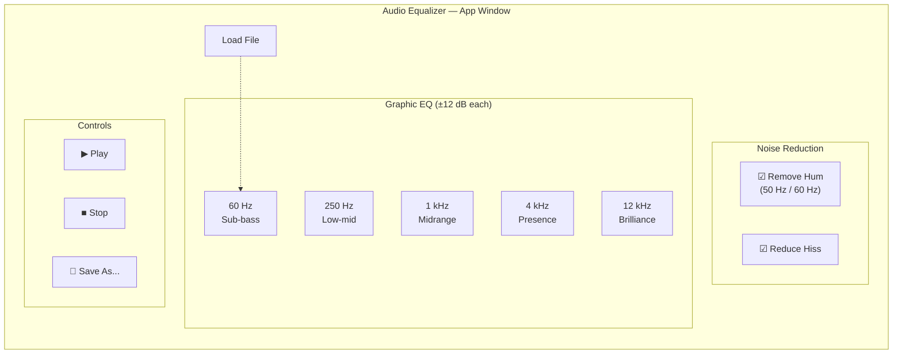
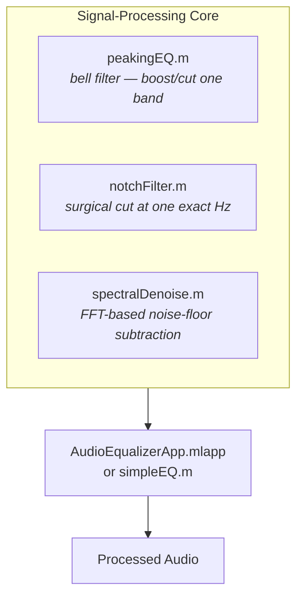

# DSP Lab Project Documentation
We are making a sound equalizer and white noise eliminator


<div align="center">

# 🎚️ MATLAB Audio Equalizer

### A 5-band graphic equalizer with hum & hiss reduction — built from scratch in base MATLAB

[](https://www.mathworks.com/)
[]()
[](LICENSE)
[]()

**Load audio → clean it up → reshape its tone → play or export.**
No toolboxes. No black boxes. Every filter written and explained from first principles.

</div>

---

## ✨ Overview

This project is a complete, offline audio-processing application written entirely in base MATLAB. You load a `.wav` or `.mp3` file, drag sliders to sculpt five frequency bands, optionally strip out mains hum and steady background hiss, then preview or save the result — all through a graphical **App Designer** interface (with a single-script alternative included).



> **Order matters:** noise reduction always runs *before* the EQ. Boosting treble before removing hiss would just amplify the hiss.

---

## 🖥️ The App



| Component | Purpose |
|---|---|
| **Load File** | Reads a `.wav`/`.mp3`, mixes to mono |
| **5 vertical sliders** | One peaking EQ filter per band, ±12 dB |
| **Remove hum** checkbox + 50/60 Hz choice | Notch filter targeting mains hum |
| **Reduce hiss** checkbox | Spectral-subtraction denoiser |
| **Play / Stop / Save As** | Run the chain, preview, and export |

---

## 🎛️ Frequency Bands

| Band Centre | Name | Character |
|---:|---|---|
| **60 Hz** | Sub-bass | Deep rumble, kick-drum body |
| **250 Hz** | Low-mid | Warmth — or "muddiness" in excess |
| **1000 Hz** | Midrange | Body of most voices and instruments |
| **4000 Hz** | Presence | Clarity, consonants, speech "edge" |
| **12000 Hz** | Brilliance | Air, sparkle, cymbal shimmer |

---

## 🧠 How It Works



- **`peakingEQ(f0, Q, gainDB, fs)`** — audio-EQ-cookbook biquad coefficients for a single band
- **`notchFilter(x, f0, fs, Q)`** — narrow-band rejection for 50/60 Hz hum
- **`spectralDenoise(x, fs, noiseSeconds)`** — learns a noise profile from silence, subtracts it via overlap-add FFT

Each function is a standalone, testable `.m` file — build and verify them individually before wiring anything to a button.

---

## 🚀 Getting Started

```matlab
% 1. Clone the repo and open the folder in MATLAB
cd('AudioEQ')

% 2. Get a test file (or drop your own .wav/.mp3 in the folder)
load handel
audiowrite('test.wav', y, Fs);

% 3. Launch the GUI
appdesigner AudioEqualizerApp.mlapp
% — or, for the single-script version —
simpleEQ
```

**Requirements:** MATLAB R2026a (or any reasonably recent release). No Signal Processing Toolbox or Audio Toolbox needed — everything is built from base MATLAB math.

---

## 🍳 Quick Recipes

Starting points, in dB per band (`60 / 250 / 1k / 4k / 12k`):

| Problem | 60 | 250 | 1k | 4k | 12k | Also enable |
|---|---:|---:|---:|---:|---:|---|
| Muffled / dull speech | 0 | −2 | 0 | +5 | +6 | — |
| Boomy / boxy recording | −3 | −5 | 0 | +2 | +2 | — |
| Thin / tinny sound | +4 | +3 | 0 | 0 | −2 | — |
| Buzzing mains hum | 0 | 0 | 0 | 0 | 0 | Remove hum |
| Hissy background | 0 | −1 | 0 | +2 | +1 | Reduce hiss |

---

## 📁 Project Structure

```
AudioEQ/
├── peakingEQ.m                 # One EQ band (core filter)
├── notchFilter.m                # Hum remover
├── spectralDenoise.m            # Hiss / background-noise reducer
├── AudioEqualizerApp.mlapp       # App Designer GUI
├── simpleEQ.m                    # Optional single-file version
└── test.wav                      # Sample input clip
```

---

## 🗺️ Roadmap

- [ ] Live frequency-response plot as sliders move
- [ ] Preset dropdown ("De-muffle", "Reduce boom", …)
- [ ] Extend from 5 → 10 bands
- [ ] A/B toggle between original and processed audio
- [ ] Stereo (dual-channel) processing
- [ ] Real-time microphone input via `audioDeviceReader` (Audio Toolbox)

---

## ⚠️ Scope & Limitations

An equalizer rebalances frequencies that already exist in a recording — it can't invent lost detail, and it won't cleanly remove *unsteady* noise. The included denoiser handles **steady** hum and hiss well; it isn't a general "make it studio quality" button.

---

## 📄 License

Released under the [MIT License](LICENSE) — use it, learn from it, extend it.

<div align="center">

*Built entirely from first principles — no black-box audio objects, just filters you can read and understand line by line.*

</div>
